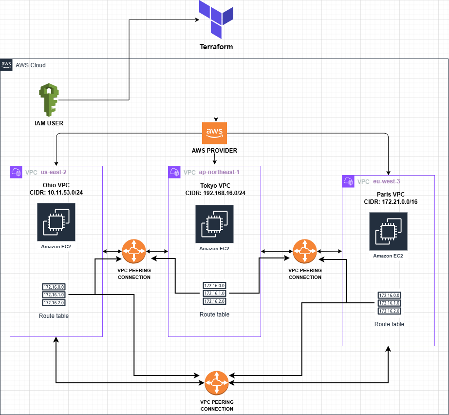

# WAN-as-Code

**Description:**  
A secure inter-continental Wide Area Network deployed using Terraform. The setup uses an IAM user for security and follows the principle of least privilege. VPC peering is managed through the AWS backbone to ensure maximum security.

---

## Requirements
- AWS root user account access  
- IAM permissions  
- AWS CLI  
- Terraform  

---

## Architectural Diagram
  
A visual representation of the inter-continental VPC setup and peering connections.

---

## Screenshots

### PIC 1
  
Navigated to the AWS dashboard and clicked the IAM section.

### PIC 2
  
Selected **Create IAM User**.

### PIC 3
  
Named the IAM user `terraform-user` and unselected access to the AWS Management Console, since the user will interact only through the CLI and Terraform.

### PIC 4
  
IAM user created successfully.

### PIC 5
  
Created a custom IAM policy called `VPCpeering` with only the necessary permissions to carry out this Terraform project, following the least privilege principle.

### PIC 6
  
Detailed view of the permissions in the `VPCpeering` policy.

### PIC 7
  
Created a new Terraform group `terraform-group` and attached both the IAM user and the custom policy.

### PIC 8
  
Generated an access key for the IAM user.

### PIC 9
  
Configured AWS CLI on my Linux machine using the IAM credentials. The default AWS CLI user is now the Terraform IAM user.

### PIC 10
  
Navigated to my Terraform directory and created `main.tf`. Defined the Terraform block and provider blocks for three regions: `us-east-2`, `ap-northeast-1`, and `eu-west-3`. Ran `terraform init` to install the AWS provider.

### PIC 11
  
Imported and initialized a VPC creation module from the Terraform Registry to create the Ohio VPC and sub-resources (subnets, AZs, NAT gateway, route table).

### PIC 12
  
Replicated the module for the Tokyo and Paris VPCs with their respective parameters.

### PIC 13
  
Created a VPC peering connection between Ohio and Tokyo VPCs.

### PIC 14
  
Created a VPC peering connection between Tokyo and Paris VPCs.

### PIC 15
  
Created a VPC peering connection between Ohio and Paris VPCs.

### PIC 16
  
Used a module to create EC2 instances and security groups in Ohio VPC, allowing ICMP (ping) from Tokyo and Paris VPCs.

### PIC 17
  
Created EC2 instances and security groups in Tokyo and Paris VPCs with inbound rules allowing ping from the other EC2 instances.

### PIC 17B
  
Added SSM access in the EC2 module for private instances with no IP and no SSH key, since Instance Connect is not possible.

### PIC 18
  
Ran `terraform fmt`, `terraform init`, and `terraform validate` to fix any errors and ensure all required providers are installed.

### PIC 19
  
Ran `terraform plan` to preview the resources that would be created.

### PIC 20
  
Applied the configuration using `terraform apply`. The Wide Area Network of VPCs is now deployed.

### PIC 21
  
From the Ohio EC2 instance in `us-east-2`, pinged the private IPs of the Tokyo and Paris EC2 instances.

### PIC 22
  
From the Tokyo EC2 instance, pinged Ohio and Paris private IPs.

### PIC 23
  
From the Paris EC2 instance, pinged Ohio and Tokyo private IPs.

**Confirmation:** All VPCs are properly peered and connected. Despite being in separate networks, they communicate securely over the AWS backbone without using the public internet.

---

## Notes
- VPC peering is **not transitive**. For a network of 7+ VPCs, a **Transit Gateway** would be a better solution.

---

